# /create-code-diagram Skill

## Purpose

Generates a comprehensive Mermaid class diagram of the entire project's codebase. Shows every class, interface, entity, handler, service — and how they relate to each other (inheritance, implementation, dependency, composition).

This is for **humans** — when you want to see the full picture, understand the system, or debug your mental model of the architecture.

## Flow

### 1. Scan the Codebase

Use codebase-memory-mcp (if available) or direct file scanning to discover:

- All classes, records, interfaces, enums, abstract classes
- Inheritance relationships (class extends base)
- Interface implementations (class implements interface)
- Dependencies (constructor injection, method parameters)
- Composition (class has property of another class type)
- Mediator handlers and which commands/queries they handle

### 2. Organize by Layer

Group discovered types by architectural layer:

```
%% Domain Layer
%% Application Layer — Interfaces
%% Application Layer — Features
%% Infrastructure Layer
%% API Layer — Endpoints
```

For each layer, list all types with their key members (properties for entities, methods for services/handlers).

### 3. Map Relationships

For each type, determine relationships:

| Relationship | Mermaid Syntax | When |
|-------------|---------------|------|
| Inheritance | `Child --|> Parent` | class extends base class |
| Implementation | `Impl ..\|> Interface` | class implements interface |
| Dependency | `ClassA --> ClassB` | constructor injection, method call |
| Composition | `ClassA *-- ClassB` | has property of type ClassB |
| Association | `ClassA o-- ClassB` | collection of ClassB |

### 4. Generate Mermaid Diagram

Create a complete `classDiagram` in Mermaid format. Include:

- Every class/interface with key members
- Every relationship with correct arrow type
- Layer grouping with `%% comments`
- Namespace grouping where applicable

### 5. Write to File

Default output: `.claude/docs/code-diagram.md`

If an output path is provided as argument, use that instead.

File format:

```markdown
# Code Diagram

> Auto-generated by /create-code-diagram on {date}
> Re-run `/create-code-diagram` to update after code changes.

## Full Project Diagram

{mermaid diagram here}

## Legend

| Symbol | Meaning |
|--------|---------|
| `--|>` | Inherits from |
| `..\|>` | Implements interface |
| `-->` | Depends on (injected) |
| `*--` | Contains (composition) |
| `o--` | Has collection of |

## Statistics

- Total types: {count}
- Classes: {count}
- Interfaces: {count}
- Records: {count}
- Relationships: {count}
- Generated: {timestamp}
```

### 6. Report

Tell the user:
- File created/updated at {path}
- Number of types and relationships discovered
- "Open in GitHub or VS Code Mermaid preview to view the diagram"

## Diagram Template

```mermaid
classDiagram
    %% ═══════════════════════════════════════
    %% DOMAIN LAYER
    %% ═══════════════════════════════════════

    class BaseEntity {
        +Guid Id
        +DateTime CreatedAt
        +DateTime? UpdatedAt
        +uint RowVersion
    }

    class IAuditableEntity {
        <<interface>>
        +string? CreatedBy
        +DateTime? ModifiedAt
        +string? ModifiedBy
    }

    class ISoftDeletable {
        <<interface>>
        +bool IsDeleted
        +DateTime? DeletedAt
        +string? DeletedBy
    }

    class User {
        +string Email
        +string PasswordHash
        +string? FirstName
        +string? LastName
    }
    User --|> BaseEntity
    User ..|> IAuditableEntity
    User ..|> ISoftDeletable

    %% ═══════════════════════════════════════
    %% APPLICATION LAYER — INTERFACES
    %% ═══════════════════════════════════════

    class IApplicationDbContext {
        <<interface>>
        +DbSet~User~ Users
        +SaveChangesAsync()
    }

    class ITokenService {
        <<interface>>
        +GenerateAccessToken()
        +GenerateRefreshToken()
    }

    class IEmailSender {
        <<interface>>
        +SendAsync()
    }

    %% ... (all interfaces)

    %% ═══════════════════════════════════════
    %% APPLICATION LAYER — FEATURES
    %% ═══════════════════════════════════════

    class PingHandler {
        +Handle(PingQuery)
    }
    PingHandler --> IApplicationDbContext

    %% ... (all handlers with their dependencies)

    %% ═══════════════════════════════════════
    %% INFRASTRUCTURE LAYER
    %% ═══════════════════════════════════════

    class ApplicationDbContext {
        +DbSet~User~ Users
    }
    ApplicationDbContext ..|> IApplicationDbContext

    class JwtTokenService
    JwtTokenService ..|> ITokenService

    class RmqEmailSender
    RmqEmailSender ..|> IEmailSender

    %% ... (all implementations)

    %% ═══════════════════════════════════════
    %% API LAYER
    %% ═══════════════════════════════════════

    class HealthEndpoints {
        +MapHealthEndpoints()
    }
    HealthEndpoints --> IMediator
```



## Important Rules

1. **Include EVERYTHING.** Don't skip small classes or "obvious" relationships. The user wants the full picture.
2. **Group by layer.** Domain → Application Interfaces → Application Features → Infrastructure → API/Socket/Worker.
3. **Show key members.** Properties for entities, methods for services/handlers. Don't list every private field.
4. **Correct arrow types.** Inheritance vs implementation vs dependency — use the right Mermaid syntax.
5. **Re-runnable.** Running again overwrites the previous diagram. Always fresh.
6. **No external tools needed.** Pure Mermaid markdown — viewable in GitHub, VS Code, any markdown renderer.
